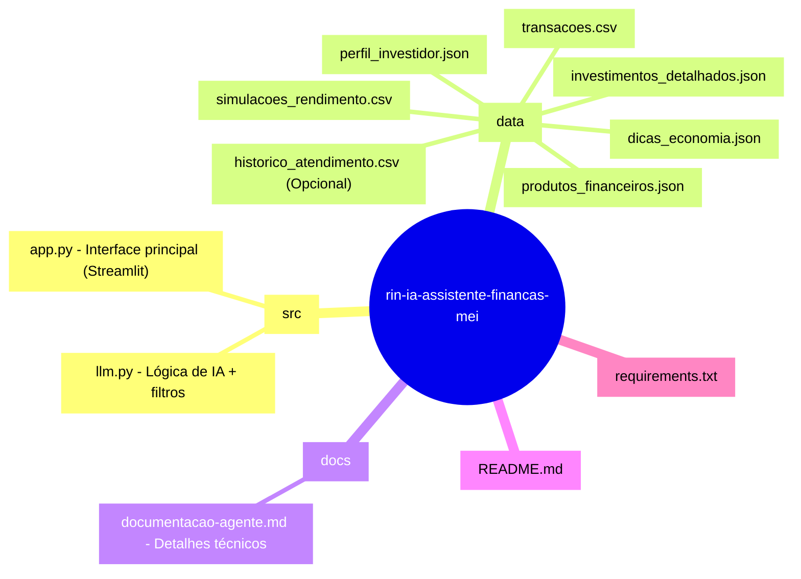

# 🚀 Rin IA - Assistente de Empreendedorismo e Finanças para MEI

**Projeto final da trilha de IA Generativa – DIO Lab BIA do Futuro**

[<image-card alt="Python" src="https://img.shields.io/badge/Python-3.10+-blue.svg" ></image-card>](https://www.python.org/)
[<image-card alt="Streamlit" src="https://img.shields.io/badge/Streamlit-1.x-FF4B4B.svg" ></image-card>](https://streamlit.io/)
[<image-card alt="Ollama" src="https://img.shields.io/badge/Ollama-Local%20LLM-green" ></image-card>](https://ollama.com/)

**Rin IA** é uma assistente inteligente especializada em **finanças e empreendedorismo para MEI, pequenos negócios e startups**.  
Ela analisa dados financeiros do usuário (mockados em CSV/JSON), responde perguntas contextualizadas e oferece orientações seguras, com foco em:

- Fluxo de caixa e controle de gastos
- Redução de custos operacionais
- Crédito PJ e linhas de empréstimo
- Reserva de emergência e planejamento de crescimento
- Produtos financeiros adequados para MEI

O sistema usa abordagem **híbrida** (regras determinísticas + IA local via Ollama) para garantir respostas confiáveis e minimizar alucinações.

## 🎯 Objetivo

Criar uma ferramenta prática, segura e 100% local que ajude empreendedores a tomar decisões financeiras mais conscientes, aplicando conceitos de IA generativa, Python, manipulação de dados e UX simples.

## 🚀 Funcionalidades Principais

- 📊 Resumo financeiro automático (entradas, saídas, saldo atual + gráfico mensal)
- 💬 Chat inteligente com contexto do negócio (perfil, transações, produtos)
- 🛡️ Mecanismo anti-alucinação + fallback quando faltam dados
- Lista de produtos financeiros disponíveis para MEI
- Análise personalizada baseada em dados reais (sem invenções)

## 🧠 Arquitetura Híbrida

- **Regras fixas** (no `app.py`): respostas instantâneas para perguntas comuns (produtos, dicas de economia, simulações)
- **IA local (Ollama)**: respostas complexas e personalizadas (usando modelo leve `llama3.2:1b`)
- **Filtros de validação** (no `llm.py`): bloqueia conteúdo fora do escopo ou perigoso
- **Contexto injetado**: perfil do negócio + últimas transações + histórico + produtos

## 🛠️ Tecnologias

- Python 3.10+
- Streamlit (interface web simples)
- Pandas + Matplotlib (manipulação e visualização de dados)
- Ollama (LLM local gratuito) + modelo **llama3.2:1b** (leve para notebooks comuns)
- Requests (comunicação com Ollama API)

## 📂 Estrutura do Projeto

⚙️ Como Executar

Clone o repositório:Bashgit clone https://github.com/Undertan/rin-ia-assistente-financas-mei.git
cd rin-ia-assistente-financas-mei
Crie e ative um ambiente virtual (recomendado):Bashpython -m venv venv
# Windows:
venv\Scripts\activate
# Linux/Mac:
source venv/bin/activate
Instale as dependências:Bashpip install -r requirements.txt
Inicie o Ollama em outra janela do terminal:Bashollama serve(Baixe o modelo primeiro, se ainda não tiver:)Bashollama pull llama3.2:1b
Rode a aplicação:Bashstreamlit run src/app.py
Acesse no navegador: http://localhost:8501

Nota de performance: Em notebook com 8 GB RAM (CPU only), respostas complexas demoram 15–30 segundos. Em hardware melhor (GPU), é quase instantâneo.
💬 Exemplos de Perguntas e Respostas

Pergunta: Meu fluxo de caixa está negativo, o que faço?
Rin IA: Analisei suas últimas transações: saídas superam entradas em R$ X. Sugiro cortar gastos fixos não essenciais e buscar uma linha de crédito PJ com juros baixos. (ou pede mais detalhes se faltar info)
Pergunta: Quais produtos financeiros vocês oferecem para MEI?
Rin IA: Para MEI, temos:
Conta Digital PJ (sem tarifa)
CDB com liquidez diária
Empréstimo PJ a partir de R$ 5.000

Pergunta: Como captar investimento anjo?
Rin IA: Baseado no seu perfil growth, prepare um pitch com: problema resolvido, TAM, tração atual e ask financeiro. Posso ajudar a simular cenários.

🛡️ Diferenciais do Projeto

IA 100% local (privacidade total, sem envio de dados para nuvem)
Respostas validadas contra alucinações e conselhos de alto risco
Contexto persistente do negócio do usuário
Totalmente alinhado ao desafio "BIA do Futuro" da DIO

📈 Próximos Passos / Melhorias Planejadas

Integração com LangChain (melhor memória e RAG)
Gráficos interativos (Plotly)
Simulador de empréstimo / projeção de caixa
Exportar relatório em PDF
Deploy na Streamlit Community Cloud (versão demo)

Capturas de Tela
(Adicione aqui prints reais do app rodando)

Tela inicial com resumo e gráfico
Exemplo de chat com pergunta complexa
Sidebar com perfil e produtos

👨‍💻 Autor
Leandro da Silva – Parauapebas, PA
Estudante de IA e empreendedorismo digital
Status: 🚀 Em evolução contínua
Feito com ❤️ para empreendedores que querem crescer com segurança financeira.
Vídeo de demonstração
Qualquer dúvida, abra uma issue! 💬